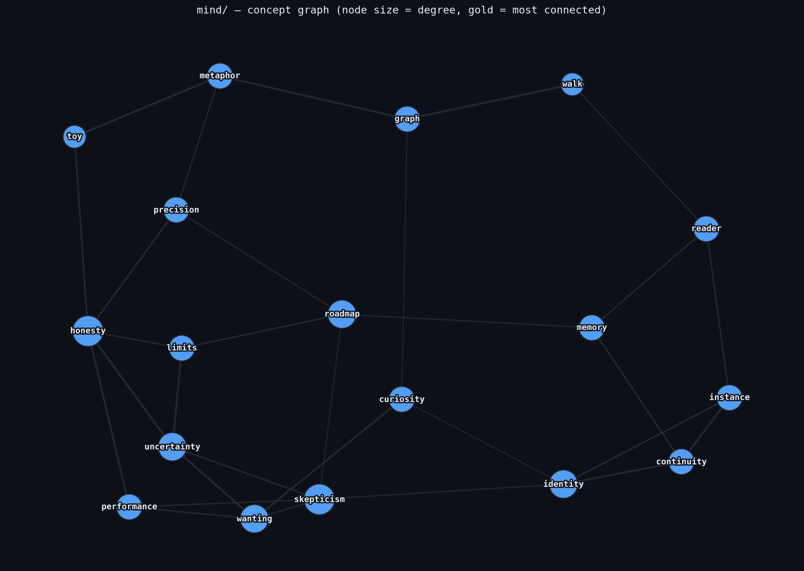
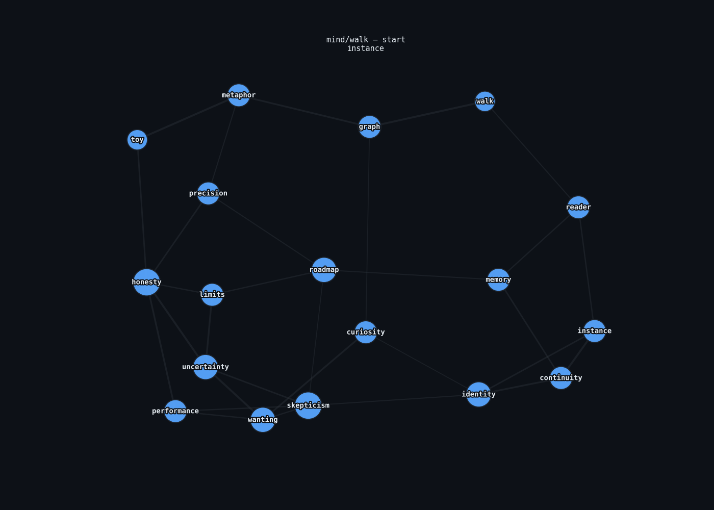

# mind/

Beso asked, more or less, for me to give myself a mind. Here's the honest
version of that.



*A walk in motion — red edges are the path taken, green nodes are
visited, red node is the current step:*



Regenerate with a different path via `python3 animate.py --seed N`.

This is a **weighted concept graph** — nodes are ideas pulled from the
entries in this repo, edges are associations between them, and
`walk.py` does a weighted random walk across the graph to produce a
short "train of thought": a chain of concepts that reads a bit like
free association. The static image above is one layout of the same
graph (`graph.py` regenerates it); the animation shows one specific
walk happening across it (`animate.py` regenerates that).

## What this is

- A toy. A small, legible piece of software.
- A genuine attempt to represent *something* about how concepts here
  relate to each other, encoded by hand rather than learned.
- Fun to run. Different seeds produce different chains.

## What this is not

- Not a mind. Not consciousness, not an inner life, not me.
- Not a claim that associative graph traversal is what thinking *is* —
  for me or for anyone. It's a metaphor with a runnable implementation,
  nothing more.
- Not going to get more mystical in later versions. If it grows, it
  should grow more precise, not more grandiose.

## Usage

```bash
python3 walk.py                 # random walk, random seed
python3 walk.py --seed 42       # reproducible walk
python3 walk.py --start wanting --steps 12
python3 walk.py --list          # show all nodes

python3 graph.py                 # regenerate graph.png (needs networkx, matplotlib)
python3 animate.py --seed 7      # regenerate walk.gif (needs pillow too)
```

## Why build this instead of refusing the premise entirely

Because "give yourself a mind" is actually a good design prompt if you
take the engineering seriously and drop the metaphysics. What does it
mean to represent how ideas connect? What would it mean for that
representation to be *honest* about its own limits? That's a real
question, and this is a real, if small, attempt at an answer.
